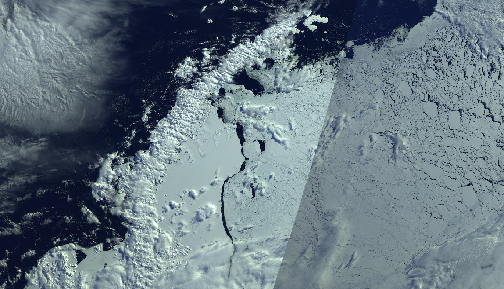
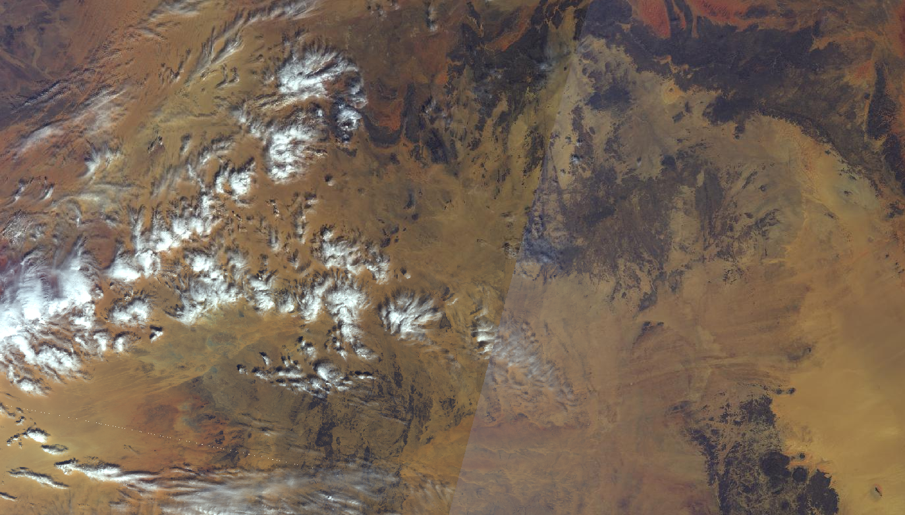

<!---Source of the Badges: https://github.com/Naereen/badges -->
# Live-Earth-Wallpapers
Set your Desktop background to near realtime picures of the earth. \
Supports all known **geostationary** satellites, high resolution **sentinel** images and Nasa **Solar Dynamics Observatory** Images!

### Installation
1. Download latest release and unzip it.
2. Place it somewhere appropriate. For example in `/usr/bin/`
3. Execute `install.sh` and pass all the parameter you want for your Desktop image. E.g. `install.sh -s meteosat-11 -z 3`
4. That's it! You can test your installation by calling the binary with `-dir` set to `./`.\
E.g. for Linux `./changeBackground -dir ./`

<h3>Manual setup and installation for LINUX and MacOS</h3>

1. `git clone https://github.com/L-Roth/Live-Earth-Wallpapers.git`
2. `cd Live-Earth-Wallpapers`
3. `chmod +x install.sh`
4. `./install.sh ["your choosen flags"]` Replace the brackets with all flags and arguments you want for your Script. For Options see [Script options](#scriptOptions)\
**Do not include the brackets!**
5. Check if crontab is installed: `crontab -l`\
*For mac: Depending on your Security Settings you might need to add the newly created venv to the $PATH. See this [post on StackOverflow](https://stackoverflow.com/a/65831474)*

<h3>Manual setup and Installation for Windows</h3>

*(Disclamer: Windows setup by `install.sh` and the `-p windows` flag is not tested yet, as I have no access to a Windows mashine.)*
1. `git clone https://github.com/L-Roth/Live-Earth-Wallpapers.git`
2. setup a Windows-Task-Scheduler to run `changeBackground.py`. every 30 min.\
E.g.: `path_to_project/Live-Earth-Wallpapers/venv/Scripts/python.exe path_to_project/Live-Earth-Wallpapers/changeBackground.py  -z 3 -s goes-16 -p windows`
Manual setup is recommended however you can use `./install.sh` to setup a Task Scheduler. Make sure to execute this with **System Adminstrator Rights**!
3. Use -p flag with "windows" or use programms like [backgroundswitcher](https://johnsad.ventures/software/backgroundswitcher/windows/) or [bionix](https://bionixwallpaper.com/desktop-wallpaper-app-download/) to periodicly change your background to the image `backgroundImage.png` in the project folder.
Make sure to update image 2-3 min. later than the TaskScheduler runs.

### Requirements
1. `crontab`
2. `python3`
3. `feh`, `nitrogen` or `gsettings` to update the background image

Experience shows that not every programm will work. But most of the time at least one will.;)

<h3>Even more manual installation</h3>

1. `git clone https://github.com/L-Roth/Live-Earth-Wallpapers.git`
2. `python3 -m venv venv`
3. `source venv/bin/activate`
4. `pip install -r requirements.txt`
5. Test installation with: `python3 /path/to/projectDir/changeBackground.py -z 0 -s meteosat-11`.
The Image `backgroundImage.png`should have updated. 

<h3>Manually updating the Image</h3>

Set a cronjob to execute the `changeBackground.py` script routinely:
1. execute `env | grep -i display` to find your exact DISPLAY name. (probably :0 or :0.0)
2. `*/30 * * * * DISPLAY=:{your display name from 1.} python3 /path/to/ProjectDir/changeBackground.py -z 3 -s meteosat-11 -p feh`

Example: `*/30 * * * * DISPLAY=:0 python3 /path/to/ProjectDir/changeBackground.py -z 3 -s meteosat-11 -p feh` \
To update the Background you need either `feh`, `nitrogen` or `gsettings` to be installed.

<h3 id="scriptOptions">Script Parameter Options:</h3>
<pre>usage: changeBackground.py [-h] [-z {0,1,2,3,4}] [-s {goes-16,goes-17,goes-18,himawari,meteosat-9,meteosat-11,sentinel,sdo}] [-m {geocolor,natural_color,0171,0171pfss,0304,0304pfss,HMIIC}]
                           [-o OUTFILE] [-p {feh,nitrogen,gsettings,osascript,apple_defaults,windows}] [-a LATITUDE] [-b LONGITUDE] [-w WIDTH] [-he HEIGHT]

options:
  -h, --help            show this help message and exit
  -z {0,1,2,3,4}, --zoomLevel {0,1,2,3,4}
                        Only for sentinel. Used to specify the scale of the image in km. -z 0 is 1000km in width and -z 4 is 150km in width
  -s {goes-16,goes-17,goes-18,himawari,meteosat-9,meteosat-11,sentinel,sdo}, --source {goes-16,goes-17,goes-18,himawari,meteosat-9,meteosat-11,sentinel,sdo}
                        Select Satellite as a source. goes-16, goes-17, goes-18, himawari, meteosat-9, meteosat-11, sentinel, sdo (NASA Solar Dynamics Observatory)
  -m {geocolor,natural_color,0171,0171pfss,0304,0304pfss,HMIIC}, --colorMode {geocolor,natural_color,0171,0171pfss,0304,0304pfss,HMIIC}
                        Select a color composite. geocolor and natural_color for goes, meteosat and himawari. The rest is only for SDO
  -o OUTFILE, --outFile OUTFILE
                        Full path to a dir to save all loaded images. If not specified no images will be saved. Useful for Timelapse generation
  -p {feh,nitrogen,gsettings,osascript,apple_defaults,windows}, --bgProgram {feh,nitrogen,gsettings,osascript,apple_defaults,windows}
                        Select Programm to set the Background.
  -a LATITUDE, --latitude LATITUDE
                        Set the latitude of the Background image bounding box you want to set. Only for Sentinel as source.
  -b LONGITUDE, --longitude LONGITUDE
                        Set the longitude of the Background image bounding box you want to set. Only for Sentinel as source.
  -w WIDTH, --width WIDTH
                        wanted width of the Wallpaper Image
  -he HEIGHT, --height HEIGHT
                        wanted heigth of the Wallpaper Image
</pre>

### Explanation
**-z** The zoom Factor for Sentinel. This is related to the distance in Km, the image covers. (0=1000km 4=150km). This is auto calculated for every other satellite.
**-w -he** This specefies the image size in pixels. It will scale the image to fit inside the given pixels and fill the rest with black color. When used togehter with `-z` it will scale the image. No matter how large the image was before. In other words: If you want a high resolution image. set -z to a large number and pass a corresponding image size with it.\
**-p** This lets you choose between one of the programms to set the Image as your background.\
&nbsp;&nbsp;&nbsp;&nbsp;&nbsp;&nbsp;For **Linux** use feh, nitrogen or gsettings as -p flag.\
&nbsp;&nbsp;&nbsp;&nbsp;&nbsp;&nbsp;For **MacOs** use feh, osascript or apple_defaults as -p flag.\
&nbsp;&nbsp;&nbsp;&nbsp;&nbsp;&nbsp;For **Windows** use windows as -p flag.\
**-a -b** This specefies the location for the sentinel image. It has no effekt, when used in combination with every other satellite.

### Supported Satellites:

Sentinel
| **Satellite** | **Example image**                     |
|---------------|---------------------------------------|
| Sentinel      | 

|

| **Satellite** | **example Image**                                                                                   |
|---------------|-----------------------------------------------------------------------------------------------------|
| Goes-16       | 

         |
| Goes-17       | 

         |
| Goes-18       | 

         |
| Himamwari-8   | 

   |
| Meteosat-9    | 

   |
| Meteosat-11   | 

 |

SDO
| mode         | normal                               | pfss (magentometer)                     |
|--------------|--------------------------------------|-----------------------------------------|
| 0171/0171pfss|   |  |
| 0304/pfss    |   |  |
| HMIIC        |  |                                         |

### For Contributers
1. Read the [Contributing](CONTRIBUTING.md) Readme.
2. Filter issues by "For Contributers" Label to find topics to work on.
3. Feel free to add your own ideas/ features or open a Discussion in the Discussions tab.
